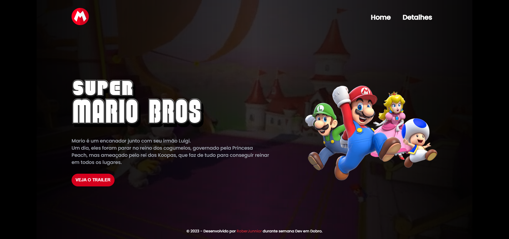

# 

<h1 align="center"> Projeto Super Mario - o Filme </h1>

  Projeto em desenvolvimento acompanhando a semana DEV EM DOBRO, codando com a parceira de estudos @mariantune - A famosa Boroca de Taubaté 😂

  <a href="#-tecnologias">Tecnologias</a>&nbsp;&nbsp;&nbsp;|&nbsp;&nbsp;&nbsp;
  <a href="#-projeto">Projeto</a>&nbsp;&nbsp;&nbsp;|&nbsp;&nbsp;&nbsp;
  <a href="#memo-licença">Licença</a>

  

 

  

    <h4> Background Original Projeto Dev em Dobro
     
     
    
     
    <h4> Background Trailer Oficial Universal Pictures 
     
     
    
  

 
 

 
  🧑‍🚀 Este projeto foi apresentado pelos irmãos Roberto e Ricardo Dias, do canal <a target="_blank" href="https://www.youtube.com/@DevemDobro">"DEV EM DOBRO".
</a>

 

## 🚀 Tecnologias

Esse projeto foi desenvolvido com as seguintes tecnologias:

<li> HTML
<li> CSS
<li> JavaScript
<li> Git and GitHub

## 💻 Projeto

O projeto esta em 60% aproximado de completude, faltando responsividade mobile, interação com javascri e alguns detalhes.
O site utiliza de background com vídeo, estilizações em CSS e algumas interações com JavaScript bem legais!

Na pasta vídeo, coloquei o arquivo do projeto mais o vídeo do Trailer Oficial do canal da Universal Pictures, assim tanto no background quanto no trailer você pode utilziar o vídeo real.   
 
NOTA: Lembrando que o vídeo  Oficial está em 16:9 então as faixas pretas do Top e Botton estarão visíveis.

[Visite o projeto online](https://robertojunnior.github.io/projeto-mario/)

## :memo: Licença

Esse projeto está sob a licença MIT.

---

Feito com muito ♥ e algumas horas de tela  😅😁:wave: 
 
 
🚀[Participe da comunidade DEV EM DOBRO no DISCORD!](https://discord.gg/73Fk62aM)

    
<h4> Obrigado por visitar meu Git e se chegou até aqui dê um "FOLLOW" que retribuo, quem sabe não podemos colaborar em algum projeto juntos?
   
   

 Até a próxima! - Bye 😁🖖.
